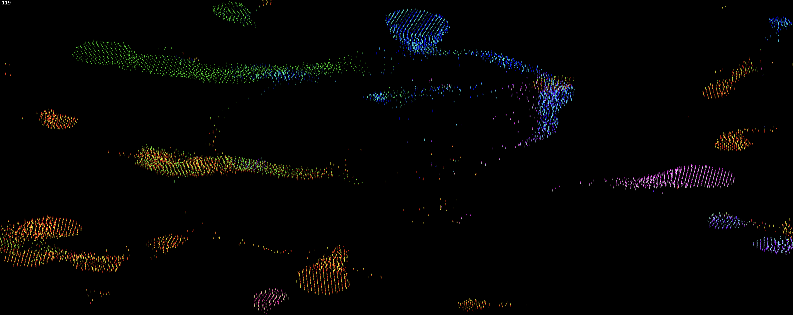

# WebGPU Boids

**Available here: https://nsimonfr.github.io/webgpu-boids/**

Initial implementation / test of https://webgpufundamentals.org/webgpu/lessons/webgpu-fundamentals.html in a project using Vite + TS.

Converted to use compute / render shaders for boids, for a more performant https://github.com/nSimonFR/wasm-boids

